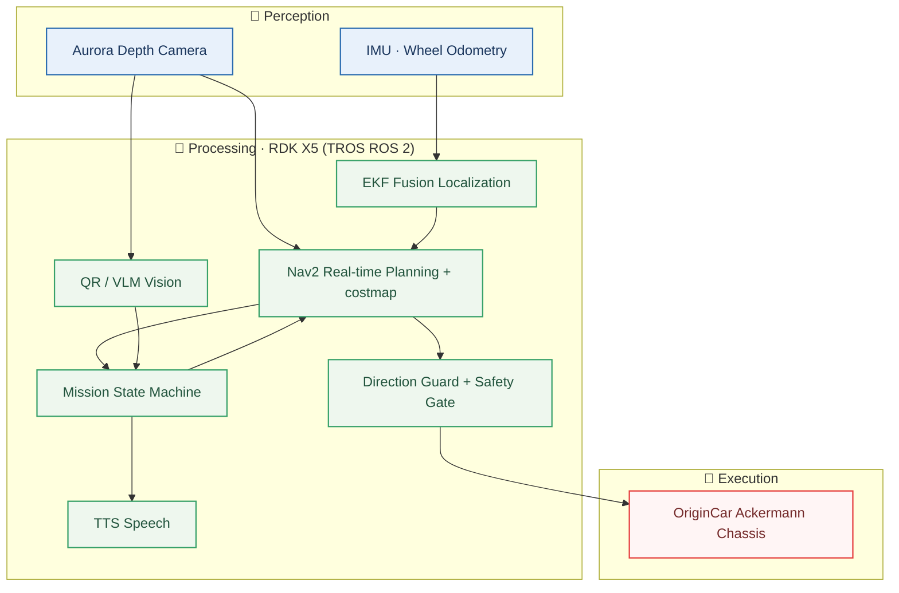

# 🧭 Team Suyuan · Smart Healthcare Smart Car

**Changzhou University** · 21st National College Students Intelligent Vehicle Competition · **D-Robotics Smart Healthcare Challenge**

> 🌐 **Languages:** [**中文版 README_cn.md**](README_cn.md) | English

| Field | Value |
| :--- | :--- |
| 🚩 **Team Name** | Suyuan (溯源) |
| 🏫 **School** | Changzhou University |
| 👨‍💼 **Team Leader** | Shen Fang |
| 👥 **Members** | Wang Shaoqing · Cao Pengyu · Zhao Yuhang · Zhou Pai |
| 🖥️ **Compute Platform** | Horizon RDK X5 8G (TROS ROS 2 Humble) |
| 🤖 **Competition Mode** | Fully automatic (with manual launch confirmation) |

---

> A fully automatic smart car for the Smart Healthcare challenge: the vehicle starts from point **P**, travels through QR observation point **A** and clinic corner **C1**, reads a QR code at A, performs an image-to-text person description and voice announcement at C1, then returns to **P**. The whole route is planned autonomously by Nav2 on the live costmap, with the Aurora depth camera as the sole vision and obstacle-perception source (RGB module for image recognition, depth module for dynamic obstacle avoidance), fused with IMU/wheel odometry for localization.

### ✨ Highlights

- **Fully automatic** — all-forward autonomous navigation; mission state machine orchestrates QR / image-to-text / voice announcement
- **Multi-modal perception** — Aurora depth camera provides both RGB vision and depth obstacle avoidance, plus IMU/wheel odometry localization
- **Real-time dynamic avoidance** — Aurora depth point cloud feeds the costmap; cleared obstacles are forgotten immediately, enabling Nav2 replanning
- **Safety first** — direction guard + fail-closed safety gate; every command passes through the Ackermann safety chain to prevent unattended auto-launch

---

## 1. Overall System Architecture



The system is layered as "Perception → Processing → Execution": sensor data is turned into motion plans by EKF and Nav2, the mission state machine orchestrates semantic tasks, and every final command must pass the direction guard and safety gate before reaching the Ackermann chassis.

## 2. Hardware Selection & Connections

| Hardware | Model | Role | Connection |
| :--- | :--- | :--- | :--- |
| 🖥️ Compute platform | Horizon RDK X5 8G | Main controller, runs TROS ROS 2 Humble | — |
| 🚗 Chassis | OriginCar Ackermann | Steering & drive execution | Serial `/dev/ttyACM0` |
| 📷 Depth camera | Aurora 930 | **RGB module** for QR/image-to-text vision, **depth module** for dynamic obstacle perception | USB |
| 🧭 Inertial / odometry | IMU + wheel encoders | Inputs to EKF fusion localization | Onboard |
| 🔊 Speech | Speaker + Volcano TTS | Announces mission results | Onboard audio |

> **Mounting constraint**: the depth camera is fixed above the front wheels, `0.15 m` off the ground, facing forward; extrinsics are a confirmed structural constraint.

## 3. Software Design

### Module Layout

```text
smartcar_bringup        System assembly & one-click launch
smartcar_task           Mission state machine & Nav2 action orchestration
smartcar_nav2           Nav2 planning / smoothing / costmap & waypoints
smartcar_safety         Direction guard + fail-closed safety gate + Ackermann output
smartcar_vision         QR(zbar) & bounded VLM services
smartcar_speech         Optional Volcano TTS & local playback
origincar               Chassis serial, wheel odometry, IMU & EKF
smartcar_tools          Waypoint editing, field reference & diagnostics
smartcar_sim            Ubuntu Gazebo simulation & pure-nav validation
```

### Key Data Flows


EKF is the sole TF owner of `odom_combined -> base_footprint`; the EKF yaw output comes entirely from the IMU z-axis angular velocity (wheel-derived yaw is unreliable and ignored; the calibrated IMU yaw is reliable). The depth point cloud serves only as Nav2 obstacle observation, not SLAM or static-map localization. The motion chain must not bypass the direction guard or safety gate.

## 4. Key Task Implementation Strategies

| Task | Strategy |
| :--- | :--- |
| 🧭 **All-forward autonomous navigation** | Every segment is planned by Nav2 on the live costmap using the Smac Hybrid `DUBIN` planner; through-pose segments use `ComputePathThroughPoses` and are smoothed by the native `ConstrainedSmoother` with collision checking, used only for that `FollowPath` — never persisted or written to YAML. Reverse planning is forbidden; at most 3 constrained straight-line `BackUp` recoveries per segment. |
| 🔳 **QR task (point A)** | zbar reads the QR code and uses its parity to select the C-zone direction (odd → counterclockwise, even → clockwise); on failure or ambiguity it deterministically falls back to counterclockwise and continues to complete the route. |
| 🖼️ **Image-to-text task (point C1)** | A bounded VLM produces a concise description of the clinic-area person/scene, with an 8 s timeout and fallback description so the mission never stalls. |
| 🔊 **Voice announcement** | Mission text is synthesized by Volcano TTS; credentials are disabled by default and can be enabled on site. |
| 🛡️ **Dynamic obstacle avoidance** | Aurora depth point cloud is converted to a forward `/smartcar/depth/scan` that feeds both costmaps; cleared obstacles emit `+Inf` beams producing explicit clearing rays that support Nav2 real-time replanning. |
| 🔒 **Safety design** | Direction guard defaults to STOP and the safety gate is fail-closed; all motion commands go through the Ackermann safety chain; five motion gates default latched to prevent unattended auto-launch. |

## 5. Competition Adaptation

- Fully **automatic mode** with a manual launch-confirmation entry; the vehicle must be manually placed at origin **P** facing `+X`.
- Complete all-forward route: `P → A → via_1 → via_2 → via_3 → via_6 → C1 → via_4 → via_5 → via_7 → P`; the real-car and simulation routes share the same geometry, differing only in the A/C1 task type.
- Navigation is strictly constrained by Nav2 generic configuration; no forced paths, prior walls, or waypoint-specific thresholds are used to mask failures.
- Voice, QR, and image-to-text media entries plus one-click system launch can be enabled independently as needed on site.

### Engineering Validation Status

- ✅ Local Gazebo completed full-route pure-navigation software validation.
- ⏳ Depth-camera dynamic obstacle perception (costmap marking / clearing and real-time replanning), QR / image-to-text / voice semantic tasks, and supervised on-site runs are still to be validated item by item.

---

## 📚 Documentation

Deployment, simulation, waypoint editing, and field procedures:

- [Docs & Architecture Index](docs/README.md)
- [RDK Deployment & Field Procedures](docs/deployment/rdk-environment-setup.md)
- [Local Gazebo Simulation](docs/deployment/local-simulation.md)
- [Waypoint Editing & Authorization](docs/deployment/waypoint-editor.md)
- [Scripts Reference](docs/deployment/scripts.md)
- [Field & Diagnostics Tools](docs/reference/field-tools.md)
