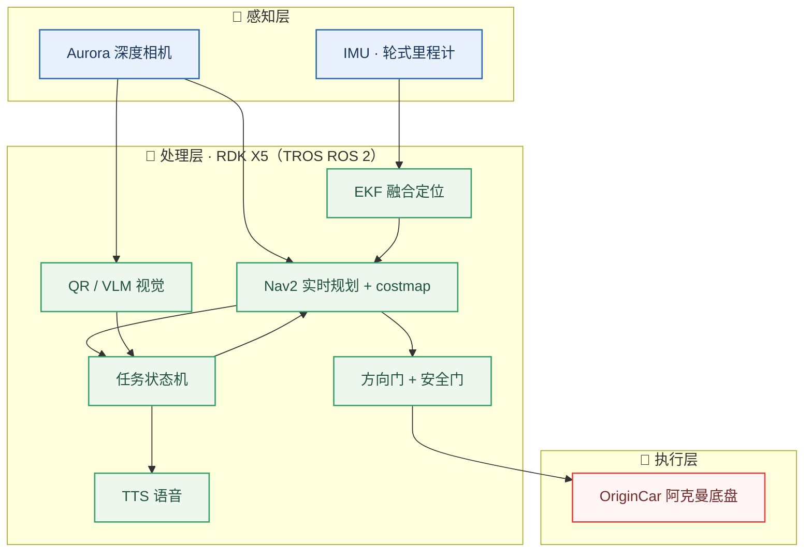
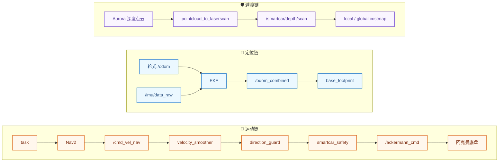

# 🧭 溯源队 · 智慧医疗赛智能车

**常州大学** · 第二十一届全国大学生智能汽车竞赛 · **地瓜机器人智慧医疗赛**

| 项目 | 内容 |
| :--- | :--- |
| 🚩 **赛队名称** | 溯源 |
| 🏫 **学校名称** | 常州大学 |
| 👨‍💼 **队长** | 沈放 |
| 👥 **组员** | 王少卿 · 曹鹏宇 · 赵宇航 · 周派 |
| 🖥️ **计算平台** | 地平线 RDK X5 8G（TROS ROS 2 Humble） |
| 🤖 **参赛模式** | 全自动模式（人工发车确认） |

---

> 面向智慧医疗赛的全自动智能车系统：车辆自 **P** 起点发车，途经二维码观察点 **A** 与诊疗区角点 **C1**，在 A 点读取二维码、在 C1 点执行图生文人物描述并语音播报，最终返回 **P** 终点。全程由 Nav2 基于实时 costmap 自主规划，以 Aurora 深度相机为唯一视觉与障碍感知来源（RGB 模块供图像识别、深度模块供动态避障），融合 IMU/轮式里程计定位，完成动态避障与语义任务。

### ✨ 系统亮点

- **全自动** —— 全正向路线自主导航，任务状态机编排二维码 / 图生文 / 语音播报
- **多模态感知** —— Aurora 深度相机同时提供 RGB 视觉与深度避障，配 IMU/轮式里程计定位
- **实时动态避障** —— Aurora 深度点云进 costmap，障碍移走即清障，支撑 Nav2 重规划
- **安全优先** —— 方向门 + fail-closed 安全门，全命令经 Ackermann 安全链，杜绝无人自动发车

---

## 一、整体系统架构



系统按「感知 → 处理 → 执行」分层：传感器数据经 EKF 与 Nav2 转化为运动规划，任务状态机编排语义任务，最终命令必须经过方向门与安全门后由 Ackermann 底盘执行。

## 二、硬件选型与连接方式

| 硬件 | 型号 | 作用 | 连接 |
| :--- | :--- | :--- | :--- |
| 🖥️ 计算平台 | 地平线 RDK X5 8G | 主控，运行 TROS ROS 2 Humble | — |
| 🚗 底盘 | OriginCar 阿克曼 | 转向与驱动执行 | 串口 `/dev/ttyACM0` |
| 📷 深度相机 | Aurora 930 | **RGB 模块**供二维码/图生文视觉输入，**深度模块**供动态障碍感知 | USB |
| 🧭 惯性 / 里程计 | IMU + 轮式编码器 | EKF 融合定位输入 | 板载 |
| 🔊 语音 | 扬声器 + 火山 TTS | 任务结果播报 | 板载音频 |

> **安装约束**：深度相机固定于前轮正上方、离地 `0.15 m`、水平朝前，外参为已确认的结构约束。

## 三、软件系统设计思路

### 模块分层

```text
smartcar_bringup        系统组装与一键启动
smartcar_task           任务状态机与 Nav2 action 编排
smartcar_nav2           Nav2 规划 / 平滑 / costmap 与航点
smartcar_safety         方向门 + fail-closed 安全门 + Ackermann 输出
smartcar_vision         二维码(zbar) 与有界 VLM 服务
smartcar_speech         可选火山 TTS 与本地播放
origincar               底盘串口、轮式里程计、IMU 与 EKF
smartcar_tools          航点编辑、场地参考与诊断
smartcar_sim            Ubuntu Gazebo 仿真与纯导航验证
```

### 关键数据流



EKF 是 `odom_combined -> base_footprint` 的唯一 TF owner；EKF 的 yaw 输出完全来自 IMU 的 z 轴角速度（轮式合成 yaw 不可靠且被忽略，标定后的 IMU yaw 可靠）。深度点云仅作 Nav2 障碍物观测，不做 SLAM 或静态地图定位。运动链不可绕过方向门或安全门。

## 四、关键任务实现策略

| 任务 | 实现策略 |
| :--- | :--- |
| 🧭 **全正向自主导航** | 所有路段由 Nav2 基于实时 costmap 规划，采用 Smac Hybrid `DUBIN` 规划器；有经过点的段用 `ComputePathThroughPoses` 生成路径并经原生 `ConstrainedSmoother` 碰撞检查平滑，结果仅供当次跟踪，不写死不落盘。全正向树禁止反向规划，每段最多 3 次受限直线 `BackUp` 脱困。 |
| 🔳 **二维码任务（A 点）** | zbar 读取二维码，判读奇偶决定 C 区绕行方向（奇数 → 逆时针，偶数 → 顺时针）；读取失败或歧义时确定性回退逆时针并继续完赛。 |
| 🖼️ **图生文任务（C1 点）** | 有界 VLM 对诊疗区人物 / 场景作简洁描述，8 s 超时与兜底描述保证任务不中断。 |
| 🔊 **语音播报** | 任务文本经火山 TTS 合成播报；凭据默认禁用，可现场启用。 |
| 🛡️ **动态避障** | Aurora 深度点云转换为前向 `/smartcar/depth/scan` 进入两张 costmap，障碍移走时空束以 `+Inf` 产生明确 clearing 射线，支撑 Nav2 实时重规划。 |
| 🔒 **安全设计** | 方向门默认 STOP、安全门 fail-closed，全部运动命令经 Ackermann 安全链输出；五个运动门禁默认锁存，防止无人自动发车。 |

## 五、与竞赛任务及规则的适配

- 赛制为**全自动模式**，发车采用人工确认入口，车辆须人工置于 **P** 原点、车头朝 `+X`。
- 完整路线全正向：`P → A → via_1 → via_2 → via_3 → via_6 → C1 → via_4 → via_5 → via_7 → P`；实车与仿真使用同一张路线，仅 A/C1 任务类型不同。
- 导航严格由 Nav2 通用配置约束，不使用强制路径、先验墙体或点位专用阈值掩盖失败。
- 支持语音、二维码、图生文三个独立媒体入口与一键系统启动，可按现场需要单独启用。

### 工程验证状态

- ✅ 本机 Gazebo 已完成纯导航全路线软件校验。
- ⏳ 深度相机动态障碍感知（costmap 标记 / 清障与实时重规划）、二维码 / 图生文 / 语音语义任务与受看护现场跑动仍需逐项验收。

---

## 📚 文档入口

详细部署、仿真、航点编辑与现场流程见：

- [文档与架构索引](docs/README.md)
- [RDK 部署与现场流程](docs/deployment/rdk-environment-setup.md)
- [本机 Gazebo 仿真](docs/deployment/local-simulation.md)
- [航点编辑与授权](docs/deployment/waypoint-editor.md)
- [脚本使用手册](docs/deployment/scripts.md)
- [场地与诊断工具](docs/reference/field-tools.md)
